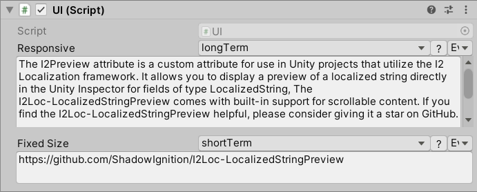

# I2LocalizationPreview Attribute

The `I2Preview` attribute is a custom attribute for use in Unity projects that utilize the I2 Localization framework. It allows you to display a preview of a localized string directly in the Unity Inspector for fields of type `LocalizedString`.



## Usage

To use the `I2Preview` attribute, follow these steps:

1. Make sure you have the I2 Localization asset integrated into your Unity project. If you haven't already done so, you can find the asset here: https://assetstore.unity.com/packages/tools/localization/i2-localization-14884

2. In your Unity script, add the `I2Preview` attribute in front of the `LocalizedString` field you want to display a preview for. You can optionally provide a line height value for fixed line height, or leave it as 0 for auto-sizing. For example:

```csharp
public class MyScript : MonoBehaviour
{
    [I2Preview]                        // Auto-sizing text area
    public LocalizedString myAutoSizedLocalizedString;

    [I2Preview(3)]                     // Fixed line height of 3 lines
    public LocalizedString myFixedHeightLocalizedString;
}
```


3. Save your script and go back to the Unity Editor. Open the Inspector for the object that contains the script you just modified.

4. In the Inspector, you will now see a preview of the localized string value associated with the `myLocalizedString` field.

## Notes

- The `I2Preview` attribute only works with fields of type `LocalizedString` from the I2 Localization framework. It will not have any effect on other types of fields.

- The `I2Preview` attribute is purely for preview purposes in the Unity Inspector and does not affect the runtime behavior of your game or application.

- If you find the `I2Preview` attribute helpful, please consider giving it a star on the GitHub repository. Your support is greatly appreciated!

## License

The `I2Preview` attribute is provided as-is under the terms of the MIT License. Feel free to modify and adapt it to suit your needs.
